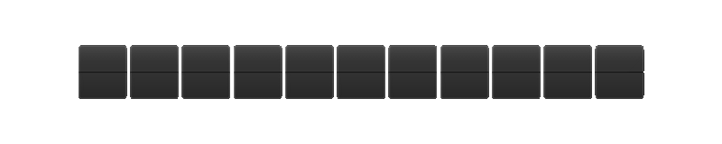

# patapata.js



Patapata-style flip display for the web.  
Demo: [https://cosa338.github.io/patapatajs/](https://cosa338.github.io/patapatajs/)

[日本語](README.md) English

A Web Components (Custom Elements) library that displays text and dates/times with a "patapata" flip animation.

- No dependencies (Vanilla JS / CSS)
- Grapheme-aware when supported (emoji / combining marks via `Intl.Segmenter`; falls back to code points)
- With the `atomic` option the whole string can be treated as a single panel, enabling flap-style signboard displays

### What You Can Do

- Core features
  - Customize panel size, color, font, and font weight
  - Default values are responsive (sizes adjust to the element/container)
  - Control flip interval and animation duration (slow flips, continuous flips, etc.)
  - Choose per-character panels or treat the whole string as one panel
  - Render some panels smaller than others

- Text display
  - Fixed text (changing `value` later flips to the new text)
  - Random (`rand`): shows random characters for a while, then settles to the target text
  - Sequence: step through items at `interval` (optionally `repeat`)
  - Shuffle (time-limited): randomly switches among candidates for a set duration (`shuffle-time`)
  - Coordinated multi-line displays (JSON + `stack`)
  - Looping

- Date / Time
  - Custom formats (e.g. `YYYYMMDD`)
  - Current date/time
  - Countdown to a specified time
  - Day-of-week and AM/PM labels in Japanese/English

- Timer
  - Stopwatch
  - Countdown timer
  - Timer controls that can be placed anywhere (e.g. via `patapata-control`, freely styleable with CSS)

### Usage

Load [patapata.js](patapata.js) (or [patapata.min.js](patapata.min.js)) in HTML and place the elements.

```html
<script src="./patapata.min.js" defer></script>

<patapata-clock format="HH:mm:ss"></patapata-clock>
```

Using GitHub Pages:

```html
<script src="https://cosa338.github.io/patapatajs/patapata.min.js" defer></script>

<patapata-clock format="HH:mm:ss"></patapata-clock>
```

Using jsDelivr:

```html
<script src="https://cdn.jsdelivr.net/gh/cosa338/patapatajs@v0.1.2/patapata.min.js" defer></script>

<patapata-clock format="HH:mm:ss"></patapata-clock>
```

### Docs / Demo

- [index.html](index.html) is the documentation + demo page (live demo, copy/paste HTML generator, etc.).
- Or visit: [https://cosa338.github.io/patapatajs/](https://cosa338.github.io/patapatajs/)

### Behavior Notes

- Changing the `value` attribute of `patapata-text` later flips from the current display to the new text (with `rand` or JSON values, the display restarts as before).
- When a `patapata-clock` `diff` target is in the past, the `-` sign only appears on the total-style tokens `DDD` / `HHH` / `mmm` / `sss`. Formats like `HH:mm:ss` cannot indicate the overrun, so include a total-style token if you want to keep displaying past the target.
- `patapata-control` resolves its `for` target via `document.getElementById()`, so elements inside a Shadow DOM cannot be targeted.

### Development

```sh
npm install
npm run check
npm run test
npm run build
npm run smoke
```

- `npm run check` runs syntax checks for the distributed files, validates inline scripts in [index.html](index.html) and [display.html](display.html), and runs the TypeScript check (`noImplicitAny`).
- `npm run test` runs the unit tests in [tests/](tests/) with the built-in Node.js test runner (runs TypeScript directly, so Node.js 23.6+ is required; 24 recommended).
- `npm run build` generates [patapata.js](patapata.js) and [patapata.min.js](patapata.min.js) from [src/patapata.ts](src/patapata.ts).
- `npm run smoke` runs the browser Smoke Test with Playwright.

### Accessibility (aria-label)

- If `aria-label` is not specified, the elements automatically reflect the currently displayed value to `aria-label`.
- If you specify `aria-label`, the components will not overwrite it (so it becomes a fixed label).
- If the display is purely decorative, set `aria-hidden="true"`.

Note: For very fast-changing displays (e.g. text shuffle/rand, timers showing milliseconds), continuously changing `aria-label` may be less practical. In such cases, consider `aria-hidden="true"` or provide a stable `aria-label`.

### Dev Notes

- No dependencies (Vanilla JS / CSS) - uses only standard browser APIs (Canvas 2D, IntersectionObserver, Page Visibility, etc.)
- Canvas-based rendering - uses Canvas 2D and caches some parts using offscreen canvases
- Provided as Web Components (Custom Elements): `patapata-text`, `patapata-clock`, `patapata-timer`, `patapata-control`
- Single-file library, so it can be a handy Canvas implementation reference as well

### License

MIT License. See [LICENSE](LICENSE) for the full text.
